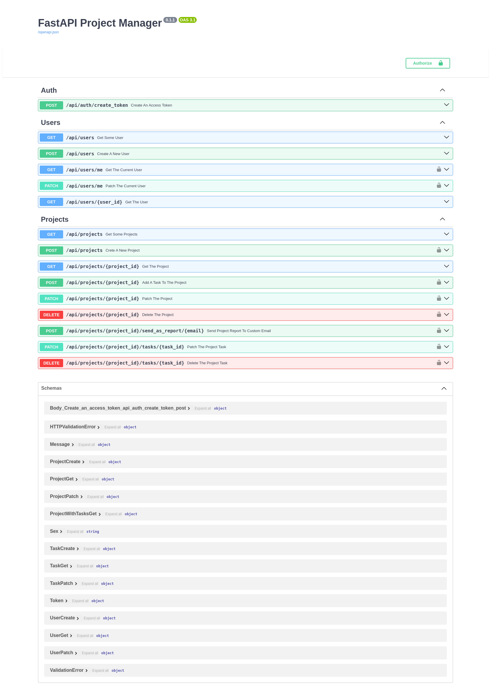

# FastAPI Project Manager
___
### Description
The goal of the application is to develop a scalable and high-performance web application using FastAPI. The application is a platform for managing tasks and projects in an organization. The application will implement a user system with differentiated access rights, the ability to create tasks, assign executors, and track the progress of tasks.
#### 1. Functional requirements of the application:
- Registration and authorization of users:
- Users can register in the system by providing a name, email address, password and other additional data.
- Registered users can log in to the system using a username and password.
- Login must be accomplished by generating a JWT token, which will be used to authenticate users when making API requests.
#### 2. Project management:
- Authorized users can create projects by specifying the title, description, tech stack, start date and constraint date of the project.
- Users can view a list of all projects, as well as detailed information about each project.
- Each project can have a responsible mentor who has the right to appoint executors of tasks within the project.
- Each project can be compiled as report and sent as email
#### 3. Task management:
- Within each project, can be created tasks that need to be completed.
- The creator and mentor of the project can indicate the title, description, executor and status (completed/not completed) of each task.

___
### Getting Started
#### Running on Local Machine
+ install dependencies using Poetry
````
$ poetry install
````
+ configure environment variables in `.env` file
+ create migration in db
````
$ alembic upgrade head 
````
+ start app in virtual environment
````
$ gunicorn -c gunicorn.conf.py asgi:app
````
#### Launch in Docker
+ configure environment variables in `.env` file
+ building the docker image
````
$ docker compose build
````
+ start service
````
$ docker compose up -d
````
____
#### Environment variables
| variables              | description                                      |
|:-----------------------|:-------------------------------------------------|
| `DEBUG`                | debug mode, only allowed 1(True)/0(False)        |
| `PORT`                 | app port                                         |
| `DOCS_URL`             | docs url, undefined by default                   |
| `REDOC_URL`            | redoc url, undefined by default                  |
| `JWT_SECRET_KEY`       | a secret key for jwt encoding                    |
| `JWT_ALGORITHM`        | jwt encoding algorithm                           |
| `ACCESS_TOKEN_EXPIRES` | access token lifetime in minutes                 |
| `PG_USER`              | PGSQL user                                       |
| `PG_PASSWORD`          | PGSQL user password                              |
| `PG_HOST`              | hostname or an IP address of PGSQL database      |
| `PG_PORT`              | port from PG database                            |
| `PG_DB`                | PGSQL database                                   |
| `PG_USERT_EST`         | PGSQL test user                                  |
| `PG_PASSWORD_TEST`     | PGSQL test user password                         |
| `PG_HOST_TEST`         | hostname or an IP address of PGSQL test database |
| `PG_PORT_TEST`         | port from PGSQL test database                    |
| `PG_DB_TEST`           | PGSQL test database                              |
| `REDIS_HOST`           | hostname or an IP address Redis database         |
| `REDIS_PORT`           | port from Redis database                         |
| `EMAIL_SMTP_SERVER`    | email SMTP server                                |
| `EMAIL_PORT`           | email port                                       |
| `EMAIL_USERNAME`       | email address                                    |
| `EMAIL_PASSWORD`       | email password                                   |
| `EMAIL_SENDER`         | email sender                                     |
| `TEST_EMAIL_RECEIVER`  | test email receiver                              |
____
#### Tech Stack
+ `FastAPI`
+ `SQLAlchemy` and `Alembic`
+ `Redis`
+ `gunicorn`
+ `pytest`, `pytest-asyncio` and `httpx` for tests
+ `docker` and `docker-compose`
