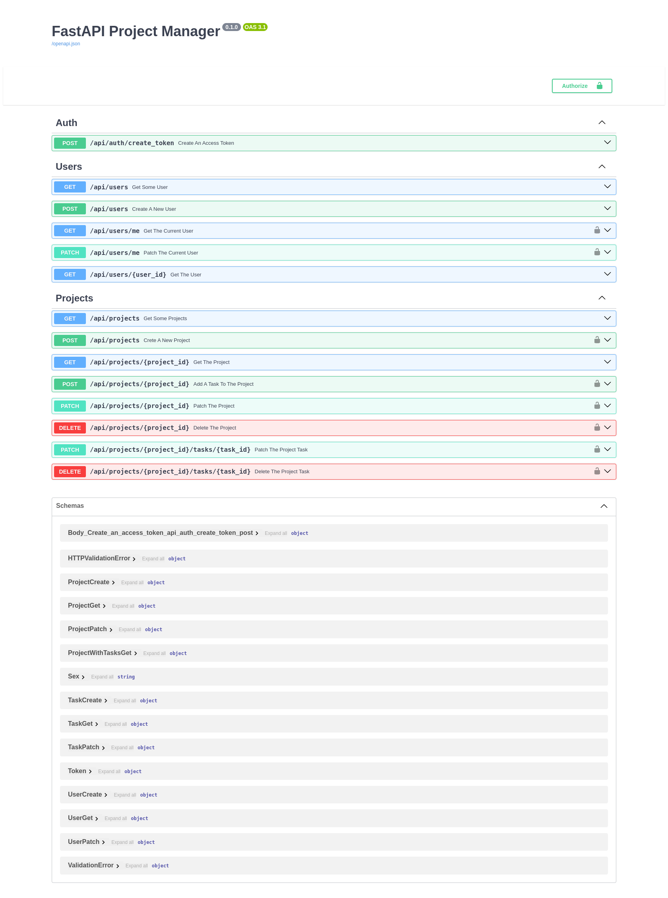

# FastAPI Project Manager
___
### Description
The goal of the application is to develop a scalable and high-performance web application using FastAPI. The application is a platform for managing tasks and projects in an organization. The application will implement a user system with differentiated access rights, the ability to create tasks, assign executors, and track the progress of tasks.
#### 1. Functional requirements of the application:
- Registration and authorization of users:
- Users can register in the system by providing a name, email address, password and other additional data.
- Registered users can log in to the system using a username and password.
- Login must be accomplished by generating a JWT token, which will be used to authenticate users when making API requests.
#### 2. Project management:
- Authorized users can create projects by specifying the title, description, tech stack, start date and constraint date of the project.
- Users can view a list of all projects, as well as detailed information about each project.
- Each project can have a responsible mentor who has the right to appoint executors of tasks within the project.
#### 3. Task management:
- Within each project, can be created tasks that need to be completed.
- The creator and mentor of the project can indicate the title, description, executor and status (completed/not completed) of each task.

___
### Getting Started
#### Running on Local Machine
+ install dependencies using PIP
````
$ pip install -r requirements/dev.txt 
````
+ configure environment variables in `.env` file
+ create tables in db
````
$ alembic upgrade head 
````
+ start app in virtual environment
````
$ gunicorn -c gunicorn.conf.py asgi:app
````
#### Launch in Docker
+ configure environment variables in `.env` file
+ building the docker image
````
$ docker compose build
````
+ start service
````
$ docker compose up -d
````
____
#### Environment variables
| variables              | description                                           |
|:-----------------------|:------------------------------------------------------|
| `PORT`                 | app port                                              |
| `JWTSECRETKEY`         | a secret key for jwt encoding                         |
| `JWTALGORITHM`         | jwt encoding algorithm                                |
| `ACCESSTOKENEXPIRESIN` | access token lifetime in minutes                      |
| `PGUSER`               | PostgreSQL user                                       |
| `PGPASSWORD`           | PostgreSQL user password                              |
| `PGHOST`               | hostname or an IP address of PostgreSQL database      |
| `PGPORT`               | port from PostgreSQL database                         |
| `PGDB`                 | PostgreSQL database                                   |
| `PGUSERTEST`           | PostgreSQL test user                                  |
| `PGPASSWORDTEST`       | PostgreSQL test user password                         |
| `PGHOSTTEST`           | hostname or an IP address of PostgreSQL test database |
| `PGPORTTEST`           | port from PostgreSQL test database                    |
| `PGDBTEST`             | PostgreSQL test database                              |
| `REDISHOST`            | hostname or an IP address Redis database              |
| `REDISPORT`            | port from Redis database                              |
____
#### Tech Stack
+ `FastAPI`
+ `SQLAlchemy` and `Alembic`
+ `redis` and `aioredis`
+ `gunicorn`
+ `pytest`, `pytest-asyncio` and `httpx` for tests
+ `docker` and `docker-compose`